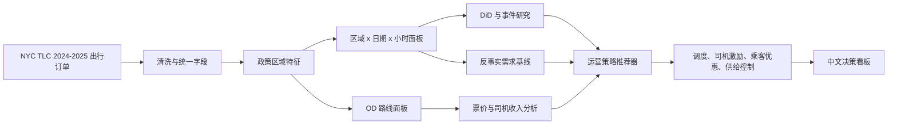
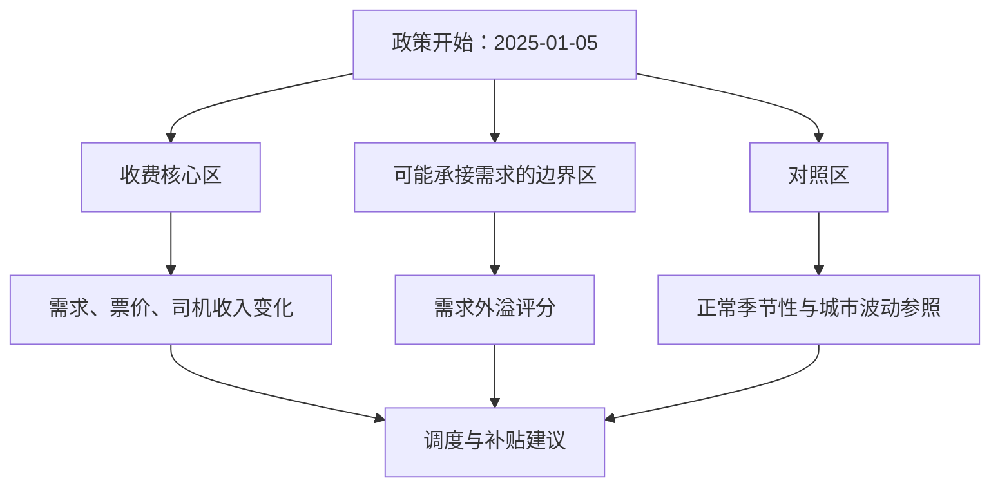

# 纽约拥堵收费冲击下的网约车运营策略推荐系统

> 把一次真实的政策变化，当成平台运营的压力测试。

## 在线演示

部署完成后，这里将放置可直接浏览的 Streamlit 成品链接。云端版本内置轻量演示数据，打开即可体验，无需下载原始订单数据。

纽约在 2025-01-05 启动拥堵收费后，进入曼哈顿核心区的出行成本发生变化。这个项目不只是看看“哪里订单多”，而是站在网约车平台的视角追问：订单会往哪里跑？乘客多付的钱有没有传导到司机？平台该把车调去哪里、又该补贴哪些路线？



## 这项目到底在解决什么？

假设你是一个网约车平台的运营负责人。拥堵收费来了以后，最怕的不是订单少一点，而是下面这几件事一起发生：

- 核心区订单变少，司机还在原地等，空驶时间变长。
- 需求往边界区域外溢，但调度策略没跟上。
- 乘客票价上升，司机实际收入却没有同步改善。
- 机场、晚高峰、短途路线各有不同的反应，却被同一套运营规则粗暴处理。

项目的目标是把这些问题拆成数据证据，再转成可执行的动作。最终交付不是“预测订单量”，而是基于需求缺口、价格压力、司机收益压力和区域外溢程度，自动生成平台运营策略推荐。

## 最终交付：可执行策略清单

每次运行推荐器都会在 `data/outputs/` 生成以下结果：

| 文件 | 业务用途 |
| --- | --- |
| `driver_supply_reallocation.csv` | 识别需要提前预部署司机的外溢/边界区域与建议时段 |
| `route_incentive_recommendation.csv` | 筛选通行成本压力和司机收益压力并存的高价值 OD 路线 |
| `passenger_discount_recommendation.csv` | 筛选需求缺口与价格压力并存、适合做乘客优惠试点的区域 |
| `operation_strategy_cards.json` | 面向看板的结构化建议：目标、证据、动作、预期影响、优先级与置信度 |
| `reports/tables/response_time_analysis.csv` | 按区域组比较政策前后 P90 接驾响应时长代理与慢响应占比 |

策略不是自动投放指令，而是带证据的试点候选池。每项动作都应先以小流量对照实验验证接单率、取消率、空驶时间和履约质量。

## 用什么数据？

| 数据 | 用途 | 为什么重要 |
| --- | --- | --- |
| NYC TLC Yellow Taxi | 传统出租车出行参照 | 补充城市整体出行观察 |
| NYC TLC High Volume FHV | 网约车平台代理数据 | 含乘客基础票价、过路费、小费、司机收入 |
| Taxi Zone Lookup | 区域、行政区、机场映射 | 识别核心区、外溢区和对照区 |

主分析以 HVFHV 为主，因为它能同时看到乘客侧价格和司机侧 `driver_pay`，这比只看订单量更接近平台实际问题。

HVFHV 还保留 `request_datetime` 和 `on_scene_datetime`。项目将两者之差作为接驾响应时长代理，用于识别外溢需求出现后司机供给是否及时跟上；它不等同于乘客端真实等待时长，因为公开数据没有接单、取消和应用内预计到达时间。

## 分析地图



### 五个业务问题

1. **核心区需求真的下降了吗？**
   - 看区域小时订单量、短途订单、早晚高峰和工作日/周末差异。

2. **需求有没有换地方？**
   - 看曼哈顿边界、布鲁克林、皇后区与热门 OD 路线的变化。

3. **价格上涨，司机收益也涨了吗？**
   - 对比每英里票价、每分钟司机收入、过路费和小费率。

4. **哪些场景最敏感？**
   - 按时段、距离、机场路线、区域类型拆开看。

5. **平台下一步怎么做？**
   - 输出司机运力重分配、路线级司机激励、乘客侧优惠、机场专项、边界区策略和低价值供给控制。

## 因果分析：不把“刚好发生”当成“政策造成”

政策后的订单变化，可能也受季节、星期、区域本身差异影响。因此项目优先采用准实验思路，而不是直接做前后对比。

```text
处理组：曼哈顿核心收费区
对照组：未直接受影响的配置化对照区

政策影响 = (处理组政策后 - 处理组政策前)
         - (对照组政策后 - 对照组政策前)
```

- **Difference-in-Differences**：控制区域、小时、星期固定效应，估计核心区相对变化。
- **Event Study**：按周查看政策前后变化，检查政策前是否已经出现不同趋势。
- **反事实需求 baseline**：用政策前数据预测“没有政策时可能出现的需求”，只作运营辅助，不冒充因果结论。

这三者的分工很简单：DiD 和事件研究负责回答“政策是否有影响”，反事实模型负责帮助运营理解“实际需求偏离了多少”。

## 指标卡片

| 视角 | 核心指标 | 它回答什么 |
| --- | --- | --- |
| 需求 | `order_count`、`log_order_count`、短途/机场订单 | 订单是否发生结构性迁移？ |
| 价格 | `fare_per_mile`、`fare_per_minute`、`tolls_per_trip` | 乘客成本怎么变了？ |
| 司机侧 | `driver_pay_per_mile`、`driver_pay_per_minute`、收入/票价比 | 司机接这类单还划算吗？ |
| 服务效率 | 响应时长均值、P50/P90、慢响应占比 | 新兴需求区域是否出现供给不足？ |
| 空间 | 核心区/外溢区/对照区订单、OD 流量 | 需求转移到哪里？ |
| 政策效果 | `did_effect`、`event_study_effect`、`counterfactual_gap` | 哪些变化更可能来自政策？ |

## 项目结构

```text
src/
  etl/          # 清洗、政策特征、区域小时与 OD 面板
  analysis/     # DiD、事件研究、外溢、价格和异质性分析
  models/       # 反事实需求基线与运营策略卡片
  warehouse/    # Hive ODS/DWD/DWS 与 PostgreSQL 结果层
  app/          # 中文 Streamlit 决策看板
config/         # 政策日期、区域分组、质量规则和模型参数
reports/        # 面向业务沟通的总结、图表与结果表
```

政策日期、核心区、外溢区、对照区和路径都放在 YAML 中，不写死在分析逻辑里。想换一组区域、复核政策定义或做敏感性分析，不需要拆代码。

## 推荐器如何工作？

推荐器不是一个黑盒分类器，而是一组可审阅的业务规则。它将每个区域或 OD 路线映射到四类 0-1 评分：

```text
demand_gap_rate = (预测的无政策订单 - 实际订单) / 预测的无政策订单
driver_pressure_score = 标准化后的通行成本变化 - 标准化后的司机每分钟收入变化
passenger_price_pressure_score = 标准化后的每英里票价变化
spillover_score = 相对订单增长 × log(1 + 政策后订单量)

final_action_score = 0.35 × demand_gap_score
                   + 0.25 × driver_pressure_score
                   + 0.20 × passenger_price_pressure_score
                   + 0.20 × spillover_score
```

评分决定试点排序，不替代业务审批。策略卡会同时给出原始证据指标、样本量、优先级和置信度，便于复核推荐是否合理。

## 看板里能做什么？

运行后打开中文的 **出行政策运营决策台**：

| 页面 | 能看到什么 |
| --- | --- |
| 首页 / 项目总览 | 快速理解项目：业务问题、重要性、数据规模、方法、最终产出、关键发现和建议 |
| 数据链路 | 原始 Parquet 到 Hive / PostgreSQL / 决策看板的完整工程路径与数据边界 |
| 需求迁移 | 区域组趋势、星期 x 小时热力图和高频调度区域 |
| 因果影响 | DiD 森林图、置信区间和事件研究曲线 |
| 反事实预测 | 实际需求、无政策预测基线和区域需求缺口排序 |
| 票价与司机影响 | 路线四象限与票价传导诊断 |
| 外溢与 OD 流向 | 外溢区域排序、异质性矩阵与机场/高峰场景判断 |
| 运营策略 | 六类业务策略卡片：动作、目标、时段、问题、证据、影响、优先级与置信度 |
| 最终成果 | 六份可下载的数据结果文件及其业务用途 |

## 如何运行？

```bash
# 1. 本地完整数据链路（含 PySpark 和数仓依赖）
pip install -r requirements-full.txt

# 2. 用真实 HVFHV 数据的有界样本跑通全链路
python src/etl/run_etl_pipeline.py --sample

# 3. 如需分阶段复跑面板，可显式执行以下三步
python src/etl/build_crz_features.py --config config/policy_zones.yaml --sample
python src/etl/build_zone_hour_panel.py --sample
python src/etl/build_od_policy_panel.py --sample

# 4. 生成政策影响、价格和外溢证据
python src/analysis/did_policy_impact.py --sample
python src/analysis/event_study_congestion.py --sample
python src/analysis/spillover_analysis.py --sample
python src/analysis/pricing_driver_impact.py --sample
python src/analysis/heterogeneity_analysis.py --sample
python src/analysis/service_efficiency_analysis.py --sample

# 5. 训练反事实需求基线并生成策略推荐
python src/models/counterfactual_demand_baseline.py --sample
python src/models/operation_strategy_recommender.py --sample

# 6. 打开看板
streamlit run src/app/streamlit_app.py
```

### 一键生成完整分析报告

```bash
python src/run_full_analysis.py --config config/analysis_config.yaml --sample
```

该命令会依次完成有界真实样本清洗、区域/OD 面板构建、需求/时段/OD/价格/司机/机场/响应效率分析、DiD、事件研究、反事实预测、策略推荐，并生成 [完整业务分析报告](reports/business_analysis_report.md)。

## 报告型成果

- [完整业务分析报告](reports/business_analysis_report.md)：按业务问题组织的 20 个章节，正文自动读取本次结果表中的真实数值。
- `reports/tables/`：数据质量、需求迁移、时段、OD、价格、司机压力、机场、响应效率、因果分析与模型结果表。
- `reports/figures/`：服务于每个业务问题的静态图表，可直接嵌入报告或项目展示材料。
- `data/outputs/`：反事实预测与可进入试点的运营策略清单。

只运行看板或部署到 Streamlit Community Cloud 时，`requirements.txt` 已刻意保持轻量，不会安装 PySpark 和 PostgreSQL 驱动。

`--sample` 不会伪造数据，而是从政策前后月份的原始 Parquet 按批读取受限样本。这样可以在普通电脑上完成演示和调试；完整研究可将同一逻辑切换到 PySpark 全量路径。

## 数仓怎么放？

```text
ODS  原始 Yellow / HVFHV / Zone 数据
  ↓
DWD  清洗后的出行明细 + 政策区域特征
  ↓
DWS  区域小时面板、OD 面板、政策效果、运营策略
  ↓
PostgreSQL / Streamlit 轻量结果与决策展示
```

Hive 保存大规模 Parquet 和分层数据，PostgreSQL 不重复塞进全量明细，只服务看板和模型结果。这是一个很朴素但挺实用的边界。

## 这份结果该怎么被诚实地使用？

当前 sample mode 用于验证工程链路和展示分析方法，不能被当作全量生产结论。更严谨的下一步包括：

- 用完整政策窗口跑 Spark 全量任务。
- 加入天气、地铁故障、节假日等外部控制变量。
- 用真实拥堵收费区多边形替代区域名称代理。
- 按区域聚类标准误，并做更多对照组敏感性检验。
- 将补贴建议接入线上小流量实验，观察接单率、取消率和司机留存。

## 相关文档

- [业务总结](reports/business_summary.md)
- [Hive 分层设计](docs_hive_design.md)
- [数据来源说明](docs_data_source.md)

---

这个项目最想表达的一点是：代码、数仓、模型和看板都不是主角，它们一起服务于一个更实际的问题：**政策改变以后，平台要怎么更聪明地运营。**
